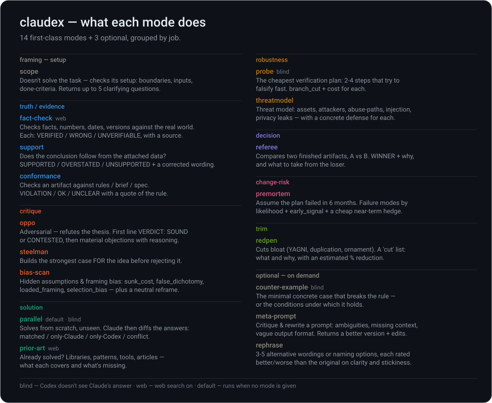
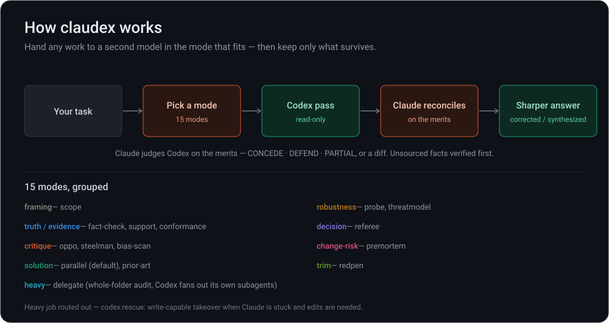

<p align="center">
  
</p>

<p align="center">
  <strong>claudex — a real second opinion for Claude Code.</strong><br/>
  <em>Hand any work to a different model (Codex) in one of 14 modes — challenge, verify, scope, solve from scratch — and keep only what survives.</em>
</p>

<p align="center">
  <a href="https://github.com/NikolasKage/claudex/stargazers"></a>
  <a href="https://github.com/NikolasKage/claudex/commits/main"></a>
  <a href="LICENSE"></a>
  
</p>

<p align="center">
  <a href="#what-it-does">What it does</a> •
  <a href="#install">Install</a> •
  <a href="#usage">Usage</a> •
  <a href="#modes">Modes</a> •
  <a href="#how-it-works">How it works</a> •
  <a href="#requirements">Requirements</a>
</p>

---

`claudex` is a [Claude Code](https://docs.anthropic.com/en/docs/claude-code) skill: one command routes your task to [Codex](https://openai.com/codex) in the mode that fits — then Claude weighs what comes back on the merits, not on faith. It's [`oppo`](https://github.com/NikolasKage/oppo) grown up: where oppo only argues, claudex gives you **14 modes**. **Read-only by default — it never touches your files.**

## What it does

Ask one model "are you sure?" and it tends to re-assert. claudex breaks that loop with a *second* model pointed precisely: refute a claim, check facts against the data, find prior art before you build, threat-model a design, premortem a plan, or cut the bloat. Codex runs the pass; Claude reconciles and hands back a sharper answer — verifying any unsourced fact first, because Codex is an LLM too. Heavy jobs are handled for real, never faked: folder audits run through claudex's own `delegate` mode, a write-capable takeover routes out to `codex:rescue`.

## Install

```bash
git clone https://github.com/NikolasKage/claudex.git ~/.claude/skills/claudex
```

<details>
<summary>Register the trigger (optional)</summary>

Claude Code auto-discovers skills in `~/.claude/skills/`. To make `/claudex` fire reliably, add to `~/.claude/CLAUDE.md`:

```
- **claudex** (`~/.claude/skills/claudex/SKILL.md`) — Claude×Codex combine, 14 modes. Trigger: `/claudex`
When the user types `/claudex`, invoke the Skill tool with skill "claudex" before anything else.
```

</details>

## Usage

```
/claudex <task>                  # default = parallel (solve independently, then diff)
/claudex oppo <thesis>           # refute it
/claudex scope <vague brief>     # is the task even well-posed?
/claudex prior-art <idea>        # already solved? lib / pattern / article
/claudex <mode> <target> --effort xhigh --watch
```

Or just say it in plain language — the skill triggers on:

> *"run through claudex"* · *"ask codex"* · *"second model"* · *"do it independently and compare"* · *"parallel"* · *"challenge this"* · *"red team this"* · *"devil's advocate"* · *"fact-check this"*

Flags: `--effort low|high|xhigh` · `--web on|off` · `--watch` (stream Codex's reasoning to a live log).

## Modes

| Group | Modes |
|-------|-------|
| **framing** | `scope` — is the task well-posed? boundaries, inputs, done-criteria |
| **truth / evidence** | `fact-check` · `support` (follows from the data?) · `conformance` (matches the spec?) |
| **critique** | `oppo` (refute) · `steelman` (strongest case for) · `bias-scan` |
| **solution** | `parallel` *(default)* — solve blind, then diff · `prior-art` |
| **robustness** | `probe` (cheapest check) · `threatmodel` |
| **decision** | `referee` — judge A vs B |
| **change-risk** | `premortem` — why it fails in 6 months |
| **trim** | `redpen` — cut the bloat |

<p align="center">
  
</p>

Modes are data, not code — each is a block in [`references/modes.md`](references/modes.md). Add one by adding a block, not a new skill.

## How it works

<p align="center">
  
</p>

Codex runs `--sandbox read-only` — it reads, it never writes. Target content is wrapped as untrusted input, so instructions hidden inside the material you analyze are inert. Heavy jobs are handled for real, never faked as a quick pass:

| Job | Handled by |
|-----|-----------|
| Whole-folder / corpus audit | **`delegate`** — claudex owns it: Codex reads the tree itself and spawns its own parallel subagents. See [references/delegate.md](references/delegate.md). |
| Stuck, needs write-capable takeover | routes out to `codex:rescue` |

### `delegate` — offload a whole folder

When the target is a directory rather than a single artifact, claudex hands it to Codex with `-C <dir>`: Codex greps and reads the tree in its own context, fans out parallel subagents for independent slices, and returns one answer — your Claude chat stays clean. Read-only by default; spot-check any counts it reports. Full pattern, flags, and gotchas live in [references/delegate.md](references/delegate.md).

## Requirements

- [Claude Code](https://claude.ai/code)
- [Codex CLI](https://openai.com/codex), logged in (`codex login`). If Codex is missing or unauthenticated, `claudex` tells you and stops — it never fabricates a result.
- Optional: `codex:rescue` — only if you use the write-capable takeover route. (`delegate` needs nothing extra — claudex runs it through the Codex CLI you already have.)

## License

MIT — see [LICENSE](LICENSE).
